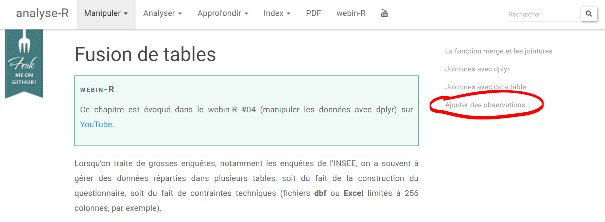
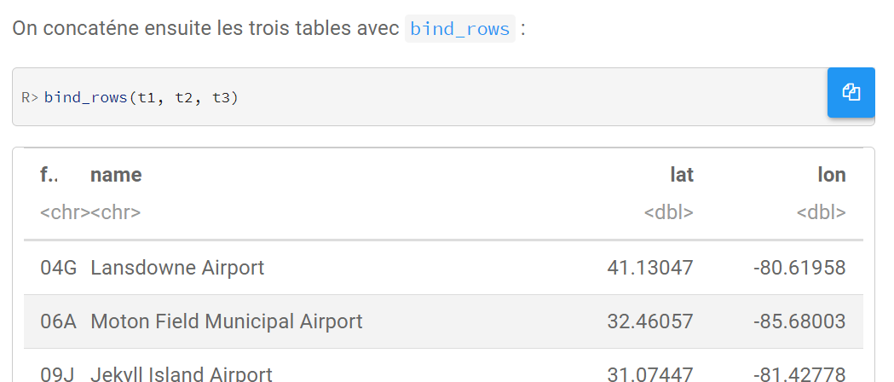
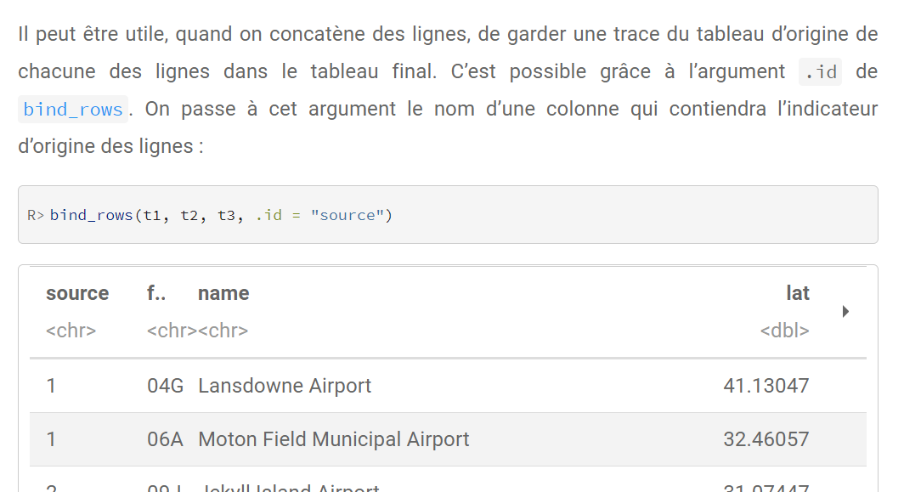

```{r setup, include=FALSE}
library(learnr)
library(tidyverse)
library(knitr)
library(janitor)
tutorial_options(exercise.timelimit = 10)
interview2019 <- read.csv("interview2019.csv")
interview2020 <- read.csv("interview2020.csv")
interview2019_reduced <- select(interview2019, -Gender)
interview2020_reduced <- select(interview2020, -Age, -Region)
interview <- bind_rows(interview2019, interview2020, .id = "dataset")

```


## Vue d'ensemble

Nous arrivons maintenant à la fin de ce cours R. Si vous avez suivi tous les tutoriels et fait les exercices, vous devriez être capable de faire beaucoup de choses avec R. Et j'espère que vous commencez à vous sentir à l'aise avec ce langage de programmation et l'interface RStudio.

Cela ne veut pas dire que le voyage est terminé. Nous n'avons couvert qu'une infime partie de tout ce que l'on peut faire avec R ! Cette fraction visait à vous préparer pour le reste du voyage. Celui où vous continuez à apprendre par vous-même, en recherchant des solutions en ligne, en lisant des bouts de documentations et en trouvant où demander de l'aide. Et vous ferez beaucoup cela. Faites nous confiance. Nous faisons cela constamment. Dans cette page, nous vous expliquons comment nous procédons et vous montrons quelques commandes R supplémentaires en cours de route.


## Trouver des solutions en ligne

Ce qui est vraiment bien avec R, c'est qu'il a une grande communauté de personnes qui sont très contente d'aider ceux qui ont des soucis. Donc en général, pour la plupart des problèmes liés à R, il est possible de trouver une solution en ligne. Vous pouvez trouver des solutions dans de nombreux endroits différents: sites de questions-réponses, forums, articles de blog, tutoriels, documentations de packages, livres en ligne, cheatsheets, vidéos, ...

Le plus simple est généralement de commencer avec un moteur de recherche comme <a href="https://www.google.fr/" target="_blank">Google</a>, ou <a href="https://rseek.org/" target="_blank">Rseek</a>. Pour le premier, puisqu'il n'est pas spécifique à R, il est important de toujours ajouter la lettre `R` dans votre recherche.


Ce qu'il faut écrire dans le champ de recherche dépend du type de problème auquel vous êtes confronté, cela peut etre une erreur a resoudre ou simplement que vous ne trouvez pas comment faire quelque chose.

**Si vous avez une erreur**

Si votre problème est que R vous donne une erreur, la première chose que vous devez faire est d'essayer de comprendre ce que signifie l'erreur, de vérifier qu'il n'y a pas de faute de frappe dans le nom des fonctions et autres objets utilisés, que les guillemets sont bien fermés et que tous les package que vous utilisez sont bien installés et chargés. Investiguez ce qui selon vous pourrent résoudre le problème. Si cela ne fonctionne pas, copiez l'erreur (ne copiez pas les noms d'objets, les chemins ou autres choses qui semblent spécifiques à votre ordinateur par contre !), Accédez à votre moteur de recherche et collez l'erreur. Ajoutez des guillemets autour. Ajoutez 'R' devant si vous n'êtes pas sur Rseek, et si vous pensez que le problème est lié à une fonction spécifique, ajoutez le nom de la fonction dans votre recherche. Cliquez sur Recherche !


Mais le plus difficile lorsque l'on essaye de corriger des erreurs n'est généralement pas la recherche. Il s'agit davantage de comprendre les réponses, de décider si elles sont pertinentes ou non pour votre cas spécifique et de choisir laquelle des solutions essayer. Le même message d'erreur peut parfois avoir plusieurs raisons possibles très différents, on doit donc souvent avancer en tatonnant. Même s'il est souvent tentant d'essayer rapidement toutes les solutions que vous pouvez trouver, le mieux à long terme est de prendre votre temps, d'en savoir plus sur le pourquoi de chaque réponse prometteuse et de prendre soing de noter ce que vous avez trouvé. Cela vous permettra de mieux résoudre les erreurs futures. Si vous avez beaucoup de mal au début, c'est probablement parce que vous n'êtes pas encore habitué aux erreurs les plus courantes, auquel cas, <a href = "https://ourcodingclub.github.io/tutorials/troubleshooting/" target = " _blank "> ce didacticiel </a> expliquant comment éviter les erreurs courantes dans R pourrait être utile.


**Si vous ne savez pas comment faire quelque chose dans R**

Si votre problème n'est pas une erreur, mais simplement quelque chose que vous voulez faire dans R, mais que vous ne savez pas comment, allez sur votre moteur de recherche et faites briller votre habilite a effectuer des bonnes recherches ! Dans la section suivante, je vous montre comment je procède:


## Exemple

À titre d'exemple, j'aimerais combiner l'ensemble de données interview2019 que nous avons utilisé dans le tutoriel "Joiture at formats long et large" avec un tableau de données fictif similaire, censé être collecté un an plus tard. Les deux ensembles de données contiennent des colonnes similaires, mais pas les mêmes individus.
Nous avons vu comment nous pourrions utiliser les fonctions `_join` pour fusionner des colonnes de différents tableaux de données, mais ici ce que je veux, c'est combiner des lignes au lieu de colonnes - c'est-à-dire: placer le deuxieme tableau de données en dessous du premier. Si je n'avais aucune idée de la façon de procéder, je taperais dans mon moteur de recherche quelque chose comme *comment combiner deux tableaux de donnees avec R ?* Notez que je n'utiliserais généralement pas de guillemets, au moins au debut.

Voila alors les trois premiers liens que google me propose :

```{r echo=FALSE, out.width="80%", fig.align='center'}

```


La premiere chose que je remarque est que je connais ces trois sites. Le premier, sthda.com est un site avec des pages donnant des commandes R pour differents sujets. Il a des articles en Anglais et en Francais qui sont generalement plutot courts et directs. Si il contient une solution a notre probleme. on devrait en general la trouver assez rapidement. Les deuxiemes et troisiemes sites (larmarange et openclassrooms) sont deux cours d'introduction a R en ligne et en Francais. Ils donnent generalement un peu plus d'explications et d'examples.

Il se trouve que le premier site nous donne deja une premiere solution possible. En effet, la page a un probleme de formatage, mais si on s'y penche un peu, on peut voir que la table des matieres contient deux choses: "Ajouter des colonnes" et "Ajouter des lignes". Pour notre probleme, c'est plutot ajouter des lignes qui nous interesse. En dessous nous avons deux commandes. On se doute alors que la deuxieme commande est celle qui pourrait nous interesser, surtout lorsqu'on lit ce qui y est ecrit:

> rbind(data frame A, data frame B) # ajoute data frame B à la suite de data frame A (en ligne).

Donc la fonction `rbind()` semble prometeuse.

Vous remarquerez cependant que les informations sont minimales. Si je n'arrive pas à adapter la commande fournie à mes besoins, je vais devoir chercher ailleurs ... mais je sais maintenant que la fonction `rbind ()` est un bon candidat pour résoudre mon problème, donc en plus de revenir aux autres résultats de ma recherche initiale, j'ai une nouvelle option: taper la commande `?rbind` dans RStudio ou rechercher quelque chose comme *r rbind exemples* dans mon moteur de recherche afin de trouver plus de documentation et d'exemples sur cette fonction. Le mot `exemples` est important ici car sans lui, on risque d'avoir beaucoup de liens en Anglais. Ce qui est bien c'est qu'en Anglais, 'exemple' s'ecrit avec un 'a' (example) donc si on indique bien a notre moteur de recherche que l'on souhaite utiliser 'exemple' avec un 'e', alors les resultats de notre recherche seront probablement pour la plupart en francais.

Quoi qu'il en soit, faisons un premier essai. Mais attendez, dois-je d'abord charger un package ? Il n'y a aucune information à ce sujet. En général, s'il n'y a aucune mention d'un package, c'est parce que la fonction est une fonction native de R. Un rapide coup d'œil à la documentation R (`?Rbind`) le confirmerait. Et R nous dira quelque chose comme 'could not find function "rbind"' si ce n'était pas le cas, donc nous le saurons.


Donc le site 'sthda' nous indique que pour ajouter le data frame B à la suite du data frame A (en ligne) il faut utiliser la commande suivante :
 
```
rbind(data frame A, data frame B) 
```

Mes tableaux de donnees sont `interview2019` and `interview2020` donc essayons ceci :


```{r bind1, exercise =TRUE}
rbind(interview2019, interview2020)
```

Argh, nous obtenons une erreur. Eh bien, nous devrions nous y habituer car cela arrivera souvent. Mais nous n'avons plus peur des erreurs, si? De plus, cette erreur la est logique. Parce que sthda était assez clair que:

> Les deux data frames **doivent** [avoir] les mêmes variables (les mêmes colonnes).


Et si nous vérifions nos noms de colonnes, nous pouvons voir qu'ils ne sont pas les mêmes:

```{r bind2, exercise =TRUE}
colnames(interview2019)
colnames(interview2020)
```

Les colonnes `Name` et `Accept` sont présentes dans les deux tableaux de données, mais la variable `Gender` n'est présente que dans le tableau de données `interview2019`, tandis que les variables `Age` et `Region` ne sont  présentes que dans le tableau de données `interview2020`.

Une solution est de se débarrasser de ces trois colonnes en utilisant `select()`. Nous pourrions indiquer les noms des colonnes que nous voulons conserver, comme d'habitude, mais nous pouvons également supprimer celles que nous ne voulons pas en utilisant le signe moins:

```{r bind3, exercise =TRUE}
interview2019_reduced <- select(interview2019, -Gender)
interview2020_reduced <- select(interview2020, -Age, -Region)
```


Essayons à nouveau notre commande `rbind`, et ajoutons une petite commande`slice` pour voir les cinq premières lignes:


```{r bind4, exercise =TRUE}

interview_reduced <- rbind(interview2019_reduced, interview2020_reduced)

interview_reduced %>% 
  slice(1:5)
```


Oui ! Il n'y a pas d'erreur! Dans RStudio, je vérifierais ensuite la fenêtre d'environnement :

```{r echo=FALSE, out.width="70%", fig.align='center'}
include_graphics("./images/Environment.JPG")
```


71 obs. + 60 obs. = 131 obs. et nous avons encore 2 variables. Ça a l'air bon. Ce n'est qu'une vérification rapide et vous devriez également cliquer sur la petite icône bleue à côté de chaque tableau de données dans votre fenêtre d'environnement, ainsi que produire quelques résumés statistique, mais cela fera l'affaire pour cette session.


### Trouver une meilleure solution

Je peux vous avouer maintenant que `rbind ()` n'est pas forcément la fonction que j'aurais choisie. Cela fonctionne bien ici, mais il existe d'autres fonctions plus flexibles, et j'aurais donc tendance à les utiliser à la place. Tout dépend de vos besoins. Si vous avez juste besoin d'une solution rapide a utiliser une fois et c'est tout, alors optez simplement pour la première commande R qui fonctionne pour vous. Mais si vous pensez que votre problème est susceptible de se présenter régulièrement sous diverses formes, ou si vous avez le sentiment que vous aurez du mal à obtenir ce que vous voulez, alors, cela peut valoir la peine de passer un peu plus de temps dans votre recherche, pour trouver une solution qui marche également, mais qui en plus vous fera gagner du temps et de l'energie sur le long terme.

Dans mon cas, je souhaite conserver toutes mes colonnes et j'aimerais également avoir une colonne dans mon nouveau tableau de données qui garde une trace de l'origine de chaque ligne - c'est-à-dire: interview2019 ou interview2020. Je sais qu'avec un peu de travail, je peux y parvenir avec `rbind ()`, mais si j'ai beaucoup de tableaux de données à combiner, ça va être un peu pénible. Et je suis sûr que vous vous en rendrez compte aussi après avoir lu plus d'informations sur `rbind()`.


Revenons donc à notre moteur de recherche. Une chose avec laquelle vous pouvez jouer, c'est de limiter les resultat a ceux qui sont recents - qui datent de moins d'un an par exemple. Cela permet de s'assurer que les lien proposees par notre moteur de cherche ont conscience de l'existence des packages importants les plus recents. D'experience cela est une restriction de recherche assez efficace lorsque l'on cherche de l'aide en Anglais ou il existe de nombreuses reponses sur les forums d'aide (notamment [stackoverflow.com](https://stackoverflow.com/)) qui commencent a dater, mais ca l'est moins en Francais ou les liens ont plus tendance a etre des articles de blog ou des cours en ligne. Si vous comprenez un peu l'anglais, cela peut aussi etre utile de tenter des recherches en anglais, car il y a quand meme plus d'options de resources et stackoverflow est une mine d'or pour les recherches plus niches.

Mais dans notre cas, nous n'avons pas besoin d'aller jusque la. Si vous cliquez sur le second lien de notre recherche, vous arriverez sur une des pages du site **analyse-R** de Joseph Larmarange. Sur la droite, vous verrez une sorte de table des matieres de la page qui indique les differentes sections : "La fonction merge et les jointures", "Jointures avec dplyr", "jointures avec data.table" et "Ajouter des observation".

```{r echo=FALSE, out.width="100%", fig.align='center'}

```

Les jointures est ce dont nous avons deja parle dans un autre tutoriel. Cela sert a joindre des tableaux de donnees horizontalement. Par contre "ajouter des observations" semble prometeur. C'est bien ca que l'on veut faire en combinant nos deux tableaux de donnees. Lorsque l'on se rend a cette section on voit un premier encadre intitule 'IMPORTANT' :

```{r echo=FALSE, out.width="85%", fig.align='center'}
include_graphics("./images/analyseR_2.PNG")
```

Ah ben voila ! Ce site nous deconseille d'utiliser la fonction `rbind()`. A la place il nous propose la fonction `bind_rows()` qui se trouve etre fourni avec le package dplyr. Ca c'est cool ! Essayons ca. Alors. si l'on descend un peu on trouve l'endroit ou donnant la syntaxe de `bind_rows()`.


```{r echo=FALSE, out.width="90%", fig.align='center'}

```

Cela semble assez simple. Et si l'on descend un peu plus on voit meme que l'on peut "'"garder une trace du tableau d'origine de chacune des lignes" grace a l'argument `.id`


```{r echo=FALSE, out.width="90%", fig.align='center'}

```

Bon il est temps d'essayer.

```{r bind5, exercise =TRUE}

interview <- bind_rows(interview2019, interview2020, .id = "dataset")

interview %>%
  slice(1:5)

```

On verifie le numbre de lignes (131) et de colonnes (6) dans la fenêtre d'environnement. Je pense que cela a marché !


```{r echo=FALSE, out.width="70%", fig.align='center'}
include_graphics("./images/Environment2.PNG")
```


Les agriculteurs étaient-ils donc plus enclins à participer à une nouvelle expérience en 2020 par rapport à 2019?


```{r bind6, exercise =TRUE}

interview %>%
  tabyl(dataset, Accept) %>%
    adorn_percentages()%>%
      adorn_pct_formatting()
```

Pas vraiment.


### Trouvez ce qui fonctionne pour vous

Le but de cet exemple était de vous donner une idée de la façon dont je procède. Mais vous devriez explorer et voir ce qui fonctionne pour vous. Parce qu'il existe de nombreuses autres façons de procéder, certaines dont je n'ai pas conscience. Par exemple, je viens de découvrir la fonction appelée `findFn ()` du package `sos` qui recherche les pages d'aide des packages R. La syntaxe est simple. Vous écrivez simplement des mots-clés dans la fonction et entourez tout le texte de guillemets. Il ouvre ensuite une page Web avec les résultats. Il faut par contre mettre des mots cles en anglais, car l'aide de R est en Anglais. Vous pouvez en apprendre plus sur le paquet `sos` dans sa vignette <a href="https://cran.r-project.org/web/packages/sos/vignettes/sos.pdf" target="_blank">ici</a>.


Oh oui, je n'ai pas parlé des vignettes encore. Comme nous l'avons vu, chaque paquet décent est livré avec au moins une documentation de base de ses fonctions à laquelle vous pouvez ensuite accéder via `?`. Mais ce n'est pas très convivial et pas du tout utile si vous ne connaissez pas la fonction que vous souhaitez utiliser. Les développeurs sont également encouragés à rédiger des guides conviviaux plus longs appelés «vignettes» qui prennent souvent la forme d'un tutoriel ou d'un article passant en revue les fonctionnalités les plus importantes du package. Lorsqu'elles existent - et c'est généralement le cas pour les bons packages - je trouve que les vignettes sont le meilleur moyen d'avoir une bonne idée de ce qu'un package a à offrir. Taper "r vignette nom-du-package" dans votre moteur de recherche vous amènera généralement à sa(ses) vignette(s). Sinon, si le package est installé sur votre ordinateur, vous pouvez taper cette commande:

```
vignette("name-of-the-package")
```

Les vignettes sont en anglais en general, mais souvent elles resent utiles pour les nombreux exemples meme pour ceux qui ne sont familier avec l'Anglais.


## Demander de l'aide

Vous devriez toujours commencer par chercher des solutions par vous-même. C'est ainsi que vous apprenez le plus. Mais à un moment donné, si vous n'arrivez pas a résoudre votre problème, vous devriez probablement envisager l'étape suivante: demander de l'aide.

Il y a plusieurs endroits où vous pouvez demander de l'aide :


**RMS!**

Premièrement, il y a nous, le support en methode de recherche (RMS). Nous sommes payés pour vous soutenir, alors n'hésitez pas à nous contacter lorsque vous avez besoin d'aide. Plus précisément au sein de RMS, les personnes qui devraient être les plus en mesure de vous aider sont Joris (joris@stats4sd.org) et Sam (s.dumble@stats4sd.org). Joris parle francais, pas Sam, meme si il est assez bon en google translate ! Mais vous pouvez aussi simplement contacter la personne que vous connaissez, peut-etre c'est Issouf, Francis, ou bien Roger. S'ils ne savent pas repondre, ils sauront trouver la meilleure personne pour répondre à la question. Vous pouvez trouver nos adresses e-mail sur notre page d'équipe Stats4SD: https://stats4sd.org/team, ou sur la page d'IDEMS, l'equipe de David https://www.idems.international/our-team/.


**Forum du Cirad**

Le [forum du Cirad](http://forums.cirad.fr/logiciel-R/viewforum.php?f=3) est un "Un forum **francophone** d'échange autour du logiciel de calcul statistique R" ou vous pouvez posez toutes les questions R que vous souhaitez apres vous y etre inscrit en suivant les indications [ici](http://forums.cirad.fr/logiciel-R/viewtopic.php?f=1&t=631). Veillez d'avoir verifie que votre question n'a pas encore ete posee en faisant une recherche dans le forum.

**Communaute grrr**

grrr est une communaute Slack **francophone** sur R, ouverte a tous et notamment aux debutants. Pour rejoindre cette comunaute il faut se diriger [ici](https://join.slack.com/t/r-grrr/shared_invite/zt-46utbgb9-uvo_bg5cbuxOV~H10YUX8w). L'inscription a Slack peut faire un peu peur pour ceux qui ne sont pas trop a l'aise avec les nouvelles technologies du web, mais cela vaut la peine de s'y pencher, car cette comunaute est tres dynamique !


**Stack Overflow**

Si vous etes un peu a l'aise avec l'Anglais, Stack Overflow est l'un des meilleurs endroits pour poser des questions. C'est probablement l'endroit ou je trouve le plus de reponses a mes questions liees a R. Ce n'est pas une plate-forme spécifique à R, alors assurez-vous de marquer votre question comme «R». Si vous prévoyez d'y publier votre question, lisez attentivement leur page <a href="https://stackoverflow.com/help/how-to-ask" target="_blank"> How to ask a good question </a> , pour augmenter vos chances d'obtenir de bonnes réponses et aider les personnes qui essaieront de répondre à votre question. Et pendant que nous y sommes, jetez un œil <a href="https://stackoverflow.com/tags/r/info" target="_blank"> cette page </a> qui contient de nombreux liens vers des ressources utiles liées à R.

Notez également que si vous avez des questions liées aux statistiques ou à la Data Science, vous pouvez les poser sur leur site sœur <a href="https://stats.stackexchange.com" target="_blank">Cross Validated</a>.


**Communaute RStudio**

Ces dernières années, le <a href="https://community.rstudio.com" target="_blank"> forum de discussion </a> de la communauté RStudio est devenu un autre endroit populaire pour poser des questions sur R pour ceux qui sont a l'aise avec l'anglais. Si votre problème est directement lié à RStudio ou à l'un des packages tidyverse, c'est probablement le meilleur endroit pour poser votre question. Comme pour les autres plates-formes, pensez a bien lire et suivre les directives de la <a href="https://community.rstudio.com/t/welcome-to-the-rstudio-community/" target="_blank"> Page de bienvenue </a> avant de poser une question.


## Appendice: Les donnees

Dans cette session, nous utilisons deux jeux de données relatifs a des entretiens fictifs de 2019 et 2020 où les agriculteurs ont été invités à indiquer s'ils accepteraient de participer ou non à une nouvelle expérience.


La description des colonnes est donné ci-dessous.

**Jeu de donnees 'interview2019'**

```{r, echo=FALSE,message=FALSE,warning=FALSE}


data.frame(Column=c("Name","Gender","Accept"),
           Description=c("Nom de l'agriculteur","Sexe de l'agriculteur","Accepteriez-vous de paticiper a une nouvelle etude experimentalle ?")) %>% kable()

```


**Jeu de donnees 'interview2020'**


```{r, echo=FALSE,message=FALSE,warning=FALSE}


data.frame(Column=c("Name","Age","Region","Accept"),
           Description=c("Nom de l'agriculteur","Age de l'agriculteur","Localisation de la ferme","Accepteriez-vous de paticiper a une nouvelle etude experimentalle ?")) %>% kable()

```


## Appendice: Liens utiles

Formidable liste de liens francophones lies a R ! <a href="https://github.com/frrrenchies/frrrenchies/" target="_blank">https://github.com/frrrenchies/frrrenchies/</a>


Rseek: <a href="https://rseek.org/" target="_blank">https://rseek.org/</a>

Comment eviter les erreurs les plus communes en R - Coding Club<a href="https://ourcodingclub.github.io/tutorials/troubleshooting/" target="_blank">https://ourcodingclub.github.io/tutorials/troubleshooting/</a>

Le forum du Cirad: <a href="http://forums.cirad.fr/logiciel-R/viewforum.php?f=3" target="_blank">http://forums.cirad.fr/logiciel-R/viewforum.php?f=3</a>

Groupe Slack francophone d'entraide a R <a href="https://rzine.fr/project/grrr/" target="_blank">https://rzine.fr/project/grrr/</a>


Page "A propos de R" de Stack Overflow: <a href="https://stackoverflow.com/tags/r/info" target="_blank">https://stackoverflow.com/tags/r/info</a>

Cross Validated: <a href="https://stats.stackexchange.com" target="_blank">https://stats.stackexchange.com</a>

Forum de discussion de la communaute RStudio : <a href="https://community.rstudio.com" target="_blank">https://community.rstudio.com</a>


